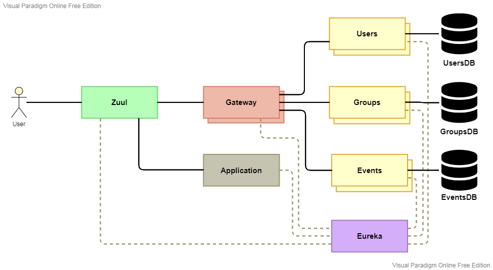

# Eventarz-Gateway

A part of my master's thesis - a simple web application for organizing events, consisting of 7 microservices:

- [Eventarz-Gateway](https://github.com/Atloas/Eventarz-Gateway)
- [Eventarz-Application](https://github.com/Atloas/Eventarz-Application)
- [Eventarz-Users](https://github.com/Atloas/Eventarz-Users)
- [Eventarz-Groups](https://github.com/Atloas/Eventarz-Groups)
- [Eventarz-Events](https://github.com/Atloas/Eventarz-Events)
- [Eventarz-EurekaServer](https://github.com/Atloas/Eventarz-EurekaServer)
- [Eventarz-ZuulServer](https://github.com/Atloas/Eventarz-ZuulServer)

Below is the description of the entire project.

# Eventarz

My thesis was titled "Development of internet-based application featuring fault tolerance and load balancing mechanisms", and involved exactly that.
I decided to use Resilience4j for fault tolerance, and Spring Cloud Load Balancer and Zuul for load balancing.

I chose to develop the application based on an earlier project of mine, where I created a simple application for organizing events: users could create accounts, join user groups, and then join events in those groups, or create their own groups and events.
The application was written in Java, using the Spring framework, in a monolithic architecture, using a Neo4j graph database, and with a classic multi-page frontend.

All microservices of the new application were also written in Java, using Spring.

#### Necessary changes

To realize the thesis I needed to:

#####1. Split the original application into microservices.
 
Monolithic architecture does not facilitate the use of load balancing and fault tolerance, so I decided to split it. This way there are many instances of inter-service communication that can benefit from fault tolerance and load balancing, and microservices is a more modern approach to web applications. 

I ended up with 7 microservices:

- Gateway - Handles requests from the frontend, performs authentication and authorization.
- Application - Serves the frontend.
- Users, Groups, Events - One microservice for each one of three data types used by the application: users, groups and events.
- EurekaServer - Central Eureka server for service discovery.
- ZuulServer - Reverse proxy and load balancer.

The image below shows the final architecture of the application, including planned instance count: two instances each of Gateway, Users, Groups and events, one each for the rest.

#####2. Implement Eureka service discovery.

Done to ease configuration and provide the load balancers with data, by creating a central Eureka server and extending each other microservice with Eureka client functionality.

#####3. Implement client-side load balancing of requests from Gateway to Users, Groups, and Events.

Gateway is the only "business" microservice that sends requests to other microservices, so it's the only one that can perform client-side load balancing.
Communication between it and the three data services was written using Feign Clients, which can be configured to use Spring Cloud Load Balancer and data from Eureka to facilitate load balancing.

#####4. Implement server-side load balancing of requests addressed to Gateway.

A Zuul server was created to serve as a common entry point to the application.
It routes incoming requests between Application and Gateway based on their addresses, and performs load balancing of requests addressed to Gateway based on data from Eureka.

#####5. Utilize Resilience4j for fault tolerance.

I added Resilience4j's Retry and Circuit Breaker mechanisms to all instances of communication between Gateway and data services, and between data services and their databases.
This required additional changes as Feign Client throws a single kind of exception no matter the issue, so a 404 error was treated the same as a connection failure, but a 404 won't go away if the request is repeated. 

#### Additional changes

Beyond simply utilizing the necessary technologies, I also decided to:

#####6. Rewrite the frontend into a React SPA.

I redid the frontend of the application from a multi-page application into a single-page application using React. It was my first React project, and even though it's rough I think it made integrating the application with the new backend easier.

#####7. Switch databases to MS SQL Server.

The Neo4j graph database used in the original project turned out to be problematic in conjunction with the new architecture.
Graph databases are suited for heavily interconnected data, which is true for this application, but since I wanted to split data access into a separate microservice per data type, having a separate database for each removes those connections.
On the other hand, using a single database for three microservices goes against the idea of microservices. In the end I decided to switch databases, and used MS SQL Server.

#####8. Implement JWT authentication.

Simple sessions used in the original application aren't suitable to be used behind load balancers, as there is no guarantee that two subsequent requests will be sent to the Gateway instance that carries the user's session.
I decided to fix this by implementing a stateless, token-based authentication mechanism.

#####9. CD

Since I had a good opportunity, I wanted to touch on the DevOps aspects of developing a web application, but as I ended up not writing any tests for this application, my "CI/CD" pipeline was left as just "CD".

I used GitHub Actions to continuously build Docker container images of the microservices, and deploy them to a Kubernetes cluster set up using Azure.

#### Conclusion

In the end my application was found acceptable, although there is certainly room for improvement.
The lack of testing is the most obvious shortcoming, but beyond that the frontend could probably use a rewrite, despite using fault tolerance database consistency is not guaranteed, and the code could be improved from a SOLID programming viewpoint.